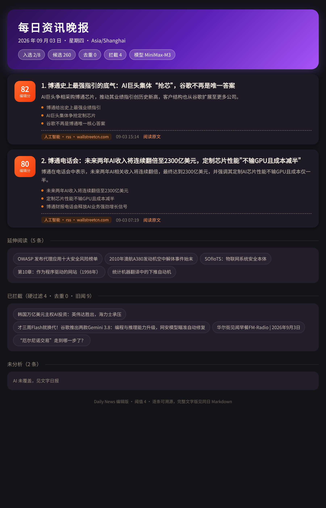

# astrbot_plugin_dailynews · 每日资讯日报

一个 [AstrBot](https://github.com/AstrBotDevs/AstrBot) 插件：把 AI 编辑过的每日资讯日报推送到你的 QQ 群/私聊。支持**早报 + 晚报双版次**、**领域订阅过滤**、**AI 模型可插拔**、**群内一键重新生成**。

## 它解决什么问题

市面上大多数"新闻推送"是把 RSS 原文转发给你，信息密度低、来源偏科。本插件配合上游流水线做了完整的**编辑链路**：

1. **多源采集** → RSS / Hacker News（Algolia API），来源可带领域预标注；
2. **AI 中文编辑** → 每条资讯生成中文标题、60 字摘要、要点、0-10 价值分与领域标签；
3. **硬过滤** → 旧闻（含 URL 路径年份核验）、广告、纯观点、教程自动拦截；
4. **事件聚合** → 标题相似度去重，同一事件多篇报道只占一个版面位；
5. **来源配额** → 同一媒体 ≤2 条、同一发现渠道 ≤2 条、单一领域 ≤40%，防止单一来源垄断版面；
6. **全局编辑选版** → LLM 一次评审全部合格事件卡，输出选题理由、读者关联与"后续 72 小时观察点"，宁缺毋滥；
7. **选题审计** → 每期生成 `selection_audit.json`，为什么选、为什么淘汰，全程可追溯。

## 特性

- 🌅 **早报**（跨夜 36 小时窗口，亮色卡片）/ 🌆 **晚报**（当日进展，暗色紫调卡片），文件按版次独立存档；
- ⏰ 定时推送时间可配置（默认 08:30 / 18:30），到点未推可在 2 小时内自动补发；
- 💬 `/早报` `/晚报` `/日报` 指令 + 自然语言（消息里带"日报/早报/晚报"即可触发）；
- 📁 **会话订阅**：在目标群/私聊发 `/日报订阅`，或直接在**插件配置页**填会话清单；
- 🏷️ **领域订阅**：`/订阅领域 科技,军事`，推送文字按你订阅的领域过滤；
- 🤖 **AI 可插拔**：任何 OpenAI 兼容或 Anthropic 兼容接口均可（MiniMax / DeepSeek / 硅基流动…），配置页直接换模型，无需改代码；
- 🔄 **群内重新生成**：说"重新整理今天的日报"，bot 代跑流水线并把新鲜结果发回群里（带冷却与并发守卫）；
- 🧾 ** degradation everywhere**：AI 挂了降级为原始汇总，图片挂了不影响文字，单源失败不阻塞其他源。

## 安装

### 方式一：插件市场（推荐）

AstrBot WebUI → 插件 → 插件市场 → 搜索"每日资讯日报"或 `dailynews` → 安装。

### 方式二：手动上传

1. 下载本仓库 zip（Code → Download ZIP）；
2. AstrBot WebUI → 插件 → 上传插件；
3. 重载插件。

## 前置条件：一份"日报成品"

本插件负责**分发与推送**，日报本身由上游流水线（采集 → AI 分析 → 选版 → 出图）生成。两种用法：

- **完整流水线**（推荐，本项目即含流水线代码）：在同一台服务器上部署流水线目录，插件配置 `pipeline_dir` 后即可使用"重新整理"功能，成品文件自动落位；
- **只当推送器**：把形如 `2026-09-03-evening.md / .png` 的成品文件放进插件数据目录（`data/plugin_data/astrbot_plugin_dailynews/`），本插件照常推送——成品如何产生它不关心。

## 群内指令

| 指令 | 说明 |
|---|---|
| `/早报` `/晚报` `/日报` | 查看对应版次（`/日报` 返回最新一版） |
| `/日报订阅` | **选定当前会话**，每天定时推送 |
| `/日报会话` | 查看已选定会话与 bot 见过的会话（含 UMO，供配置页复制） |
| `/日报推送 [早报/晚报]` | 立即向所有订阅会话补推（测试/错过推送用） |
| `/订阅领域 科技,军事` | 只接收指定领域的文字摘要 |
| `/领域日报 AI` | 按领域点看今日要闻 |
| `/日报刷新 [早报/晚报]` | 重新采集并生成（冷却默认 10 分钟） |
| `/日报状态` | 版次同步情况、订阅数、推送时间 |

自然语言：消息里带"日报/早报/晚报"即可触发（30 字以内），带"重新/刷新"走重新生成。

## 配置

全部可在 AstrBot WebUI 插件配置页修改：

| 配置 | 默认 | 说明 |
|---|---|---|
| `morning_push_time` / `evening_push_time` | 08:30 / 18:30 | 早/晚报推送时间 |
| `evening_enabled` | true | 是否启用晚报 |
| `timezone` | Asia/Shanghai | 推送时区 |
| `subscribed_sessions` | [] | 配置页直接选定会话（`群号` / `group:群号` / `private:QQ号` / 完整 UMO） |
| `default_platform` | aiocqhttp | 会话默认平台 ID |
| `send_image` / `send_text` | true | 是否发送图片 / 文字摘要 |
| `digest_max_items` | 10 | 文字摘要条数上限 |
| `custom_categories` | 八大领域 | 可订阅领域清单 |
| `ai_provider` / `ai_protocol` / `ai_base_url` / `ai_model` / `ai_api_key` | 空 | 覆盖 AI 模型（留空用流水线默认）；保存后自动写入流水线 `ai_override.yaml`，定时任务同样生效 |
| `pipeline_dir` | /home/xiajiao/news-pipeline | 流水线目录（"重新整理"用） |
| `regen_enabled` / `regen_cooldown_minutes` | true / 10 | 重新整理开关与冷却 |

## 平台说明

- 定时主动推送依赖平台的主动消息能力：**OneBot v11（NapCat）、Telegram 等完整可用**；
- QQ 官方 bot（qqofficial）对主动消息有配额与场景限制，推送失败属平台限制，可用 `/日报` 按需查看兜底。

## 常见问题

**推送显示成功但没收到？** 检查平台是否支持主动消息（见上）；QQ 官方通道需用户先与 bot 互动过。

**日报显示"还没有同步到服务器"？** 成品文件未落位 `files_dir`。若走流水线，检查 `pipeline_dir` 与生成日志；docker 部署注意卷映射。

**换了模型后分析版本混乱？** 分析结果按模型版本共存（`analysis_results` 主键含 analyzer_version），换模型只是新开一路结果，随时可切回。

**服务器时区是 UTC？** 插件按 `timezone` 配置计算推送时间与"今天"，无需改服务器时区。

## 相关项目

- 上游流水线（采集/分析/选版/渲染）与本项目一体开发，仓库结构见同组织仓库（整理中）。

## License

[MIT](LICENSE)
